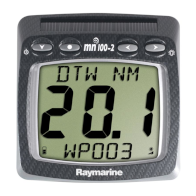
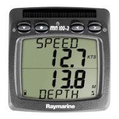
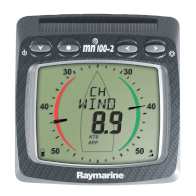
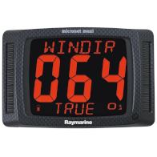
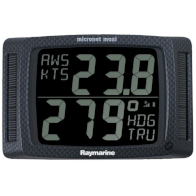
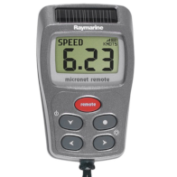
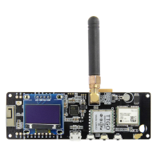
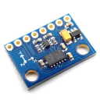

**A Micronet / NMEA bridge for TTGO T-Beam V1.1 boards**

## Description

MicroNav is a ESP32/Arduino project aiming at converting data from Raymarine/Tacktick wireless network called *Micronet* to a standard NMEA0183 stream, easily useable by your laptop or tablet software.

MicroNav is the successor of [MicronetToNMEA](https://github.com/Rodemfr/MicronetToNMEA) project. It aims at using a simpler, cheaper hardware platform with less soldering work.

MicroNav can :

- Send T-Beam's GPS data to your Micronet network (Position, COG, SOG, DATE, TIME) and to the NMEA link (GGA, RMC, VTG)
- Send Navigation/guidance data from a navigation software (OpenCPN, AvNav, qtVlm) to Micronet network (BTW, DTW, XTE, WPNAME)
- Send Micronet's data to the NMEA link (MWV, DPT, MTW, VLW, VHW, HDG, XDR)
- Send Magnetic heading from LSM303DLHC to Micronet network and NMEA link
- Be configured to match your boat configuration : you can select which set of data is received from which link (NMEA, Micronet, GPS or LSM303)

The project requires the following hardware :

- At least one display of the Raymarine/Tacktick Wireless system (T110, T111, T112, T113, T210 ot T215)

- A 868/915MHz TTGO T-Beam v1.1 with SX1276 RF IC and OLED display (like [this one](http://www.lilygo.cn/prod_view.aspx?TypeId=50060&Id=1317&FId=t3:50060:3)). Select 868MHz version if you have a Tacktick system for EU or 915MHz else.

Optionally, you can add :

- A LSM303DLHC, connected through I2C to add magnetic heading to your Micronet network

The type of construction described here is fun and interesting to play with, but anyone with a little bit
of experience at sea knows that it will not last long in the wet, salty and brutal environment of a sailing boat.
MicroNav will abandon you just when you really need it. No garantee can of course be given that this software
will do what it has been designed for. This is a DIY project, not a professional product.

If you want a robust, reliable and extensively tested Micronet device, you should better go to your nearest Raymarine/Tacktick reseller. 

## Author & Contributors

* **Ronan Demoment** - [Rodemfr](https://github.com/Rodemfr) - Main author 
* **Dietmar Warning** - [dwarning](https://github.com/dwarning) - LSM303 Compass, bugfixes & testing.
* **[j-lang](https://github.com/j-lang)** - UBLOX Initialization code

## License

MicroNav is licensed under GPLv3. See LICENSE.txt file for more details.

## Compilation

MicroNav's source code has been developped with [Visual Studio Code](https://code.visualstudio.com) and [PlatformIO](https://platformio.org) plugin. It is strongly advised to use these tools to compile the code if you don't want to enter in the swampy grounds of embedded software compilation.

## Acknowledgments

* Thanks to the guys of YBW.com forum who started the work of investigating Micronet's protocol. The technical discussions around the protocol are in this thread : https://forums.ybw.com/index.php?threads/raymarines-micronet.539500/
* Thanks to all the users of [MicronetToNMEA](https://github.com/Rodemfr/MicronetToNMEA) & MicroNav who are giving feedback and reporting problems to help improving the system.

## Development status

Fully operational:
- Micronet RX/TX with SX1276 at 868Mhz
- GPS Decoding
- NMEA through USB
- NMEA through Bluetooh

Not tested:
- Micronet RX/TX with SX1276 at 915Mhz

Not working:
- LSM303DLHC Driver (Magnetic heading)

Not developped:
- NMEA through WiFi
- Interactive configuration using OLED display & button
- Power saving , power off & battery handling